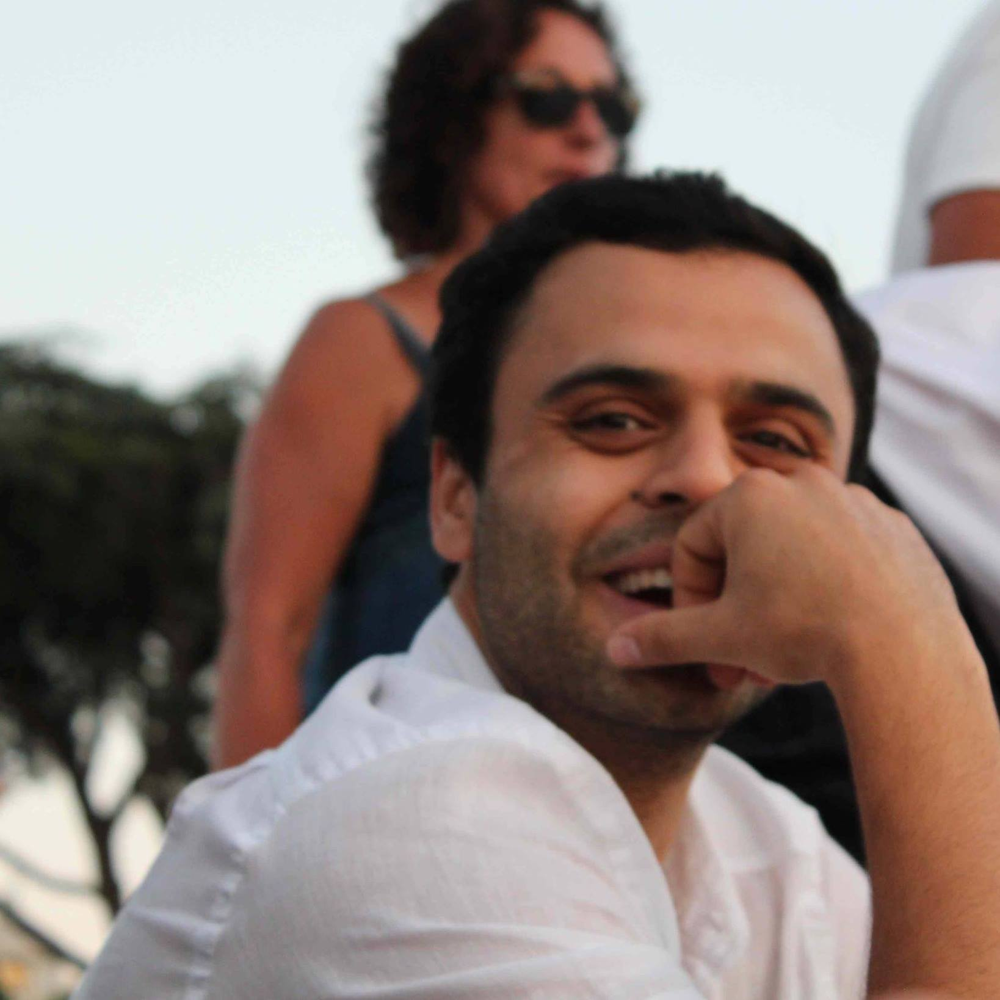

## À propos

Bienvenue sur mon site personnel. Je suis attaché temporaire d'enseignement et de recherche à l'École Pratique des Hautes Études ([EPHE](https://www.ephe.fr/)), Paris. Je suis rattaché au laboratoire [CHArt](http://www.cognition-usages.org/chart2/) (Congnitions humaines et artificielles), EA EPHE et Paris 8 

## Publications

1. Quang Vu Bui, Karim Sayadi and Marc Bui.  Combining Latent Dirichlet Alllocation and K-means for Documents Clustering: Effect of Probabilistic Based Distance Measures, To appear in ACIIDS proceedings Avril 2017 intl conference. 

2. Karim Sayadi, Quang Vu Bui and Marc Bui.  [Distributed Implementation of the Latent Dirichlet Allocation on Spark](research/soict16), Proceedings of the Sixth International Symposium on Information and Communication Technology, Ho Chi Minh City, Vietnam, 08-09 December 2016.

3. Karim Sayadi, Marcus Liwicki, Rolf Ingold, Marc Bui. [Tunisian Dialect and Modern Standard Arabic Dataset for Sentiment Analysis : Tunisian Election Context](research/acling16), IEEE-CICLing (Computational Linguistics and Intelligent Text Processing) Intl. conference, Konya, Turkey, 7-8 Avril 2016.

4. Quang Vu Bui, Karim Sayadi, Marc Bui. [A multi-criteria document clustering method based on topic modeling and pseudoclosure function](research/soict15), ACM-SOICT (Symposium on Information and Communication Technology) Intl. conference, Hue, Vietnam, 3-4 December 2015. (Extended version published in [informatica journal](http://www.informatica.si/index.php/informatica/article/view/1278))

5. Karim Sayadi, Quang Vu Bui, Marc Bui. [Multilayer classification of web pages using Random Forest and semi-supervised version of the Latent Dirichlet Allocation](research/i4cs15), IEEE-I4CS (International Conference on Innovations for Community Services) Intl. conference, Nuremberg, Germany. 8-10 July 2015.

6. Karim Sayadi, Marc Bui, Michel Lamure. Predictive topic modeling : Complex Networks approach using dynamics of author’s communities, EURO INFORMS (Operational Research), Rome, Italy, 1-4 July 2013. 

7. Karim Sayadi, Marc Bui, Vigile Hoareau, Sofian Ben Amor, Une approche prétopologique pour la catégorisation des données de microblogging, Conférence nationale VSST'12 (Veille Scientifique et Technologique), Ajjaccio, Corse, France, 24-25 Mai 2012.

### Rapport technique

1. Marc Bui, Karim Sayadi. Modèle de recommandation de contacts basé sur l'analyse thématique des échanges. Rapport du projet n 45 Nexboo. Convention Techno Pole de la Réunion. 20 Octobre 2013

### Livre

1. Karim Sayadi. Chapitre 2. Section 2 Ontologie. Estuaire(s) à venir. Centre Michel Serres. 4 Juillet 2013. [lien scribe](https://fr.scribd.com/doc/266228053/Estuaires-a-Venir)
